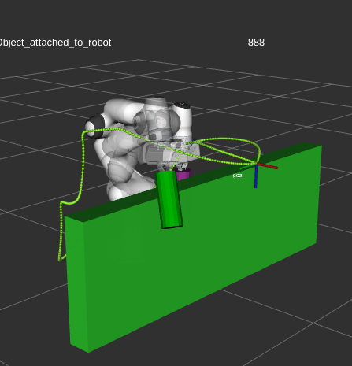
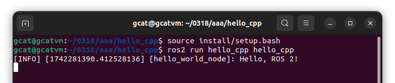
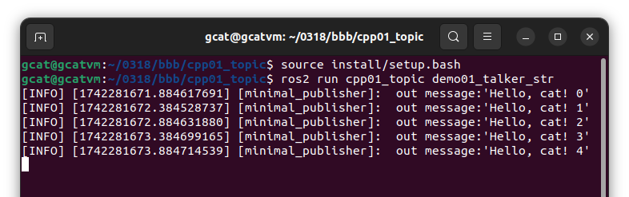
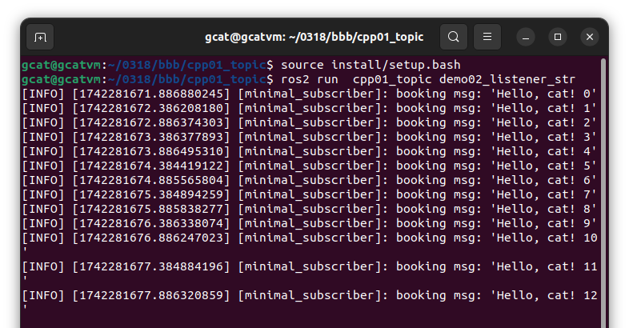
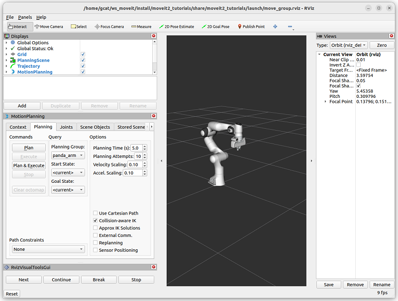
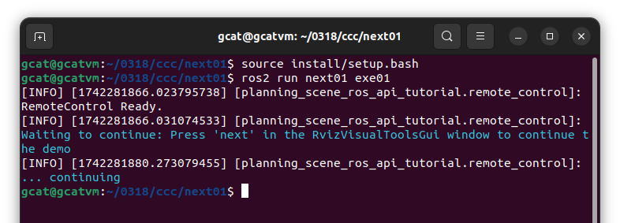
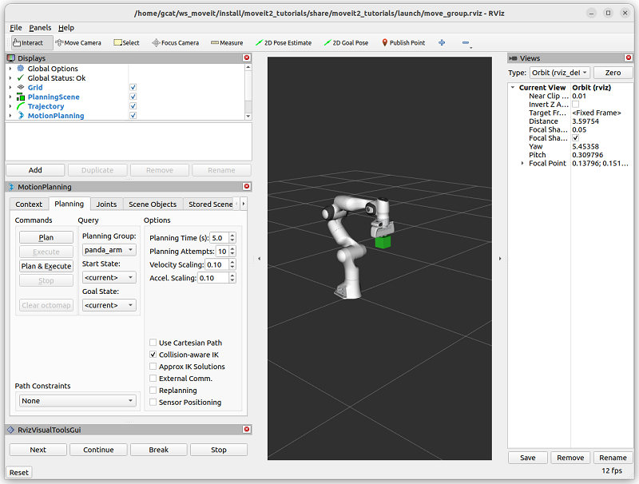
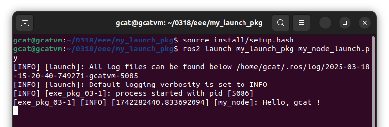
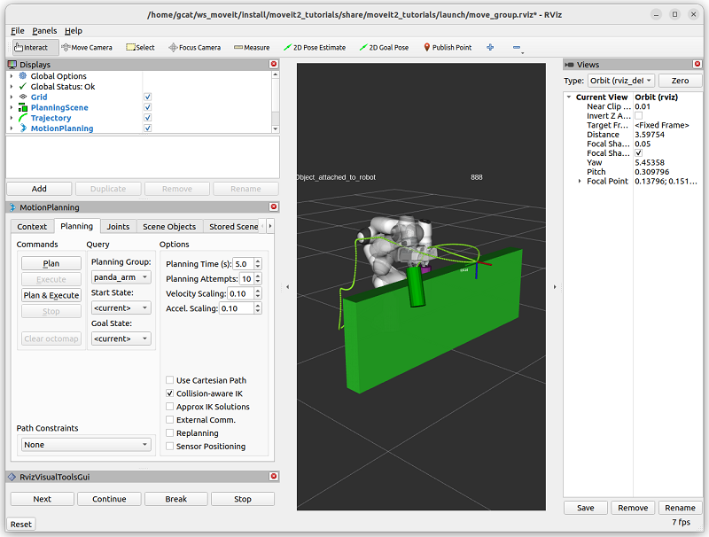

# ROS2_moveit_study_note_1
ROS2 moveit examples for quickly learning it. Ubuntu 22, humble.  
Learning attach/detach.  
Must install moveit2 tutorial prior.
 
 
 

## ex1 : "ros2 run" example, print string
### build
cp 01_hello_org/ aaa/ -r  
cd aaa/hello_cpp/  
colcon build  
 
### test
[new terminal]  
source install/setup.bash  
ros2 run hello_cpp hello_cpp  
 
 
 

## ex2 : listener and talker
### build
cp 02_cpp01_org/ bbb/ -r  
cd bbb/cpp01_topic/  
colcon build  
 
### test
[new terminal]  
source install/setup.bash  
ros2 run  cpp01_topic demo02_listener_str  
 
[new terminal]  
source install/setup.bash  
ros2 run cpp01_topic demo01_talker_str  
 
 
 
 
 

## ex3 : build [next] button, part of moveit2 tutorial planning_scene_ros_api
### build
cp 03_next01_org/ ccc/ -r  
cd ccc/next01/  
colcon build   
 
### test
[new terminal]   
cd ~/ws_moveit  
source install/setup.bash   
ros2 launch moveit2_tutorials move_group.launch.py   

[new terminal]
source install/setup.bash  
ros2 run next01 exe01  
 
press [next] button in RViz window to close program.  
 
 
 
 
 

## ex4 : single build moveit2 tutuorial example of planning_scene_ros_api
### build
cp 04_next02_org/ ddd/ -r  
cd ddd/next02/  
colcon build  
 
### test
[new terminal]  
cd ~/ws_moveit  
source install/setup.bash  
ros2 launch moveit2_tutorials move_group.launch.py  
 

[new terminal]  
source install/setup.bash  
ros2 run next02 exe02  
 
press [next] button in RViz window to run.  
 
 
 

## ex5 : "ros2 launch" example
### build
cp 05_launch03_org/ eee/ -r  
cd eee/my_launch_pkg/  
colcon build  
 
### test
[new terminal]  
source install/setup.bash  
ros2 launch my_launch_pkg my_node_launch.py  
 
 
 
## ex6 : build part of move_group_interface
### build
cp 06_attach_org/ fff/ -r 
cd fff/attach/ 
colcon build 
 
### test
[new terminal]  
cd ~/ws_moveit  
source install/setup.bash  
ros2 launch moveit2_tutorials move_group.launch.py  
 
[new terminal]  
source 1.sh  
sh rrr.sh  
press [next] button in RViz window to run.  
 
 
 
